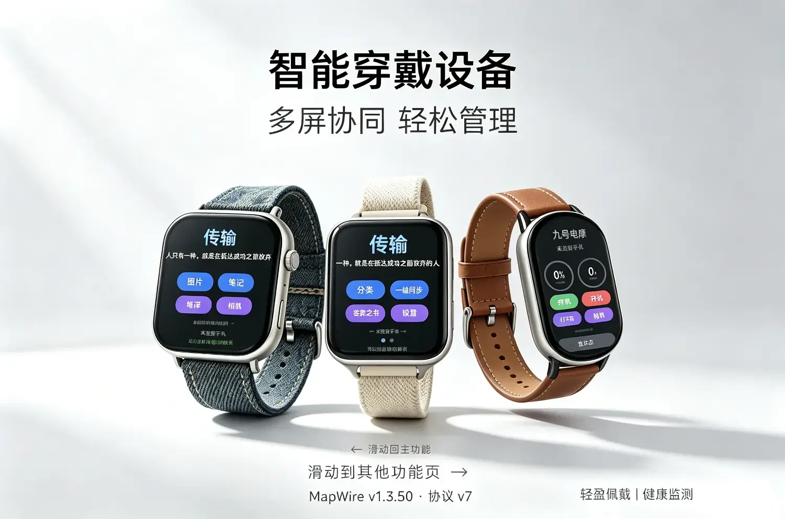
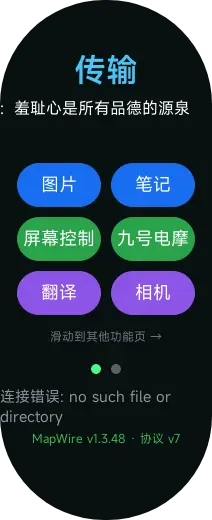
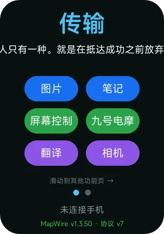

# 传输+九号电动车控制

- **双向互联，数据随身**：手表 ⇄ 手机图片/笔记双向秒传，分类跨设备一致，出门不带手机也能看到全部资料。
- **手表即遥控器**：把手机屏幕"装"进手表——滑动、点击、双击、轨迹回放，远程操控手机一切。
- **遥控拍照黑科技**：手表一键按快门，手机自动弹出相机、自动对焦拍摄、照片实时回传手表并存入手机相册，自拍不求人。
- **出行控制一体化**：手表直接控制九号电摩——开机、关机、鸣笛、开座桶、查电量，骑行体验再升级。
- **随身翻译官**：手表输入即译，中英互译，直连优先、断网自动中转，出国旅行无压力。内置答案之书
Apk内置心率悬浮窗可以在玩游戏的时候看到红温状态，内置小说自动分割，小说批量导入等
Apk配套下载链接kimi.tax/dVGCg8
爱发电赞助链接kimi.tax/dkNFpv
本人官网000.market
视频教程到b站/小红书/抖音搜索广东非凡

|  |  |
| --- | --- |
| 资源 ID | `com.cahkcs.toxun` |
| 类型 | 快应用（quick_app） |
| 作者 | cahkcs |
| 付费类型 | force_paid |
| 购买链接 | [https://afdian.com/a/cahkcs?tab=shop](https://afdian.com/a/cahkcs?tab=shop) |
| 标签 | 九号电动车 / 传输 |

## 支持设备

- Xiaomi Smart Band 10 Pro（xmb10p）
- Xiaomi Smart Band 9 Pro（xmb9p）
- REDMI Watch 5（xmrw5）
- REDMI Watch 5 eSIM（xmrw5xring）
- REDMI Watch 6（xmrw6）
- Xiaomi Watch S3（xmws3）
- Xiaomi Watch S4（xmws4）
- Xiaomi Watch S4 41mm（xmws441）
- Xiaomi Watch S4 15th Anniversary（xmws4xring）
- Xiaomi Watch S5（xmws5）
- Xiaomi Smart Band 10（xmb10）
- Xiaomi Smart Band 10 NFC（xmb10nfc）
- Xiaomi Smart Band 9（xmb9）

## 下载

| 文件 | 版本 | 设备 |
| --- | --- | --- |
| [0-传输助手_通用_1.3.5.rpk](downloads/0-传输助手_通用_1.3.5.rpk) | 1.3.50 | Xiaomi Smart Band 10 Pro（xmb10p） Xiaomi Smart Band 9 Pro（xmb9p） REDMI Watch 5（xmrw5） REDMI Watch 5 eSIM（xmrw5xring） REDMI Watch 6（xmrw6） Xiaomi Watch S3（xmws3） Xiaomi Watch S4（xmws4） Xiaomi Watch S4 41mm（xmws441） Xiaomi Watch S4 15th Anniversary（xmws4xring） Xiaomi Watch S5（xmws5） |
| [1-传输助手_米环.1.3.49.rpk](downloads/1-传输助手_米环.1.3.49.rpk) | 1.3.49 | Xiaomi Smart Band 10（xmb10） Xiaomi Smart Band 10 NFC（xmb10nfc） Xiaomi Smart Band 9（xmb9） |

## 预览

---

本仓库由 [OronBox 创作者中心](https://oronbox.zxor.org) 创建和维护。This repository is created and maintained by OronBox Creator Center.
